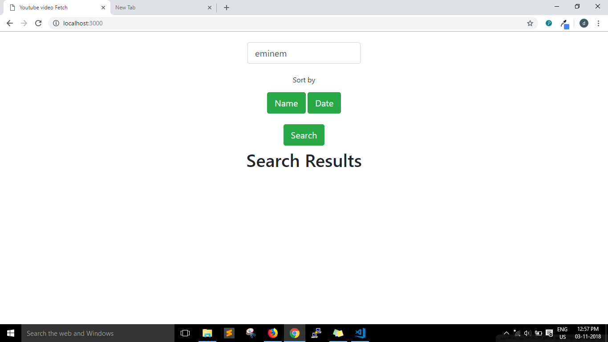
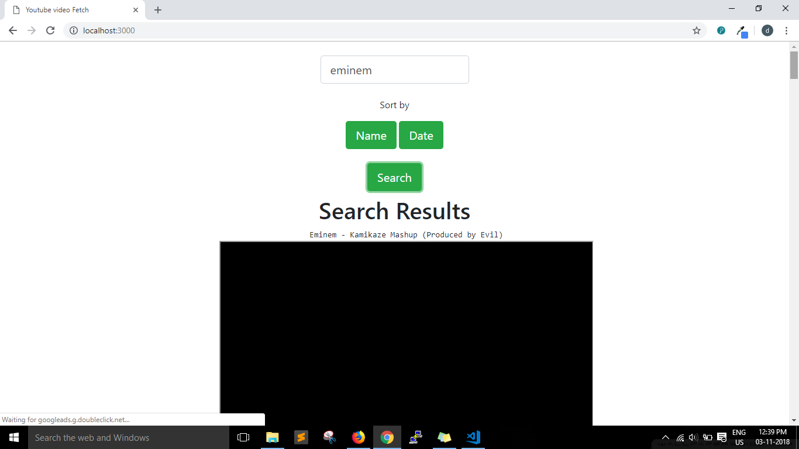
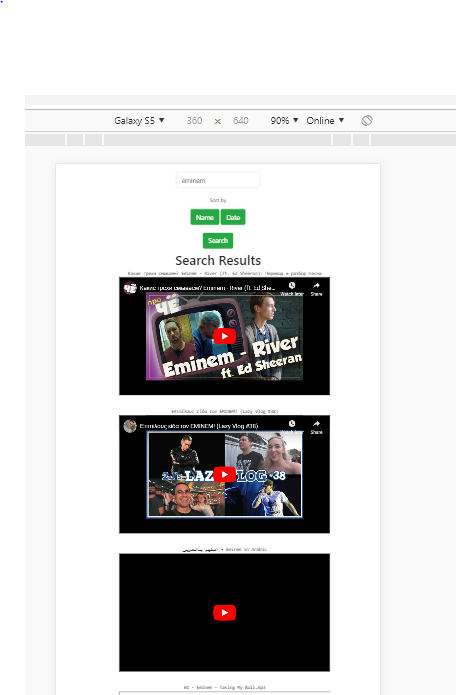

# Youtube Video Fetch

The main domain of this project is to fetch the Youtube videos based on the search.

## Getting Started

These instructions will get you a copy of the project up and running on your local machine for development.

### Prerequisites

* Install the [Node.js](https://nodejs.org/en/download/) in your PC.
* Login to [Google Developer Console](https://console.developers.google.com/).
* Create a project and search for the Youtube Data Api then enable API for the project you have created.
* Copy and Paste the API Key in the index.html[ Line: 29].
### Installing

A step by step series of examples that tell you how to get a development env running.
* Open the terminal or powershell and go to the project path and type the below command


```
 npm install
```


* open terminal or powershell and enter the below command

```
node index.js
```

open the browser and go to localhost:3000

## Built With

* [Node.js 8.12.0](https://nodejs.org/en/) - The framework used to create server 
* [Youtube Data API v3](https://developers.google.com/youtube/v3/) - Module used to fetch youtube videos

## Screenshots

   
  
  
## Authors

* **Srirama Dheeraj** - [DheerajRam13](https://github.com/dheerajram13/)


